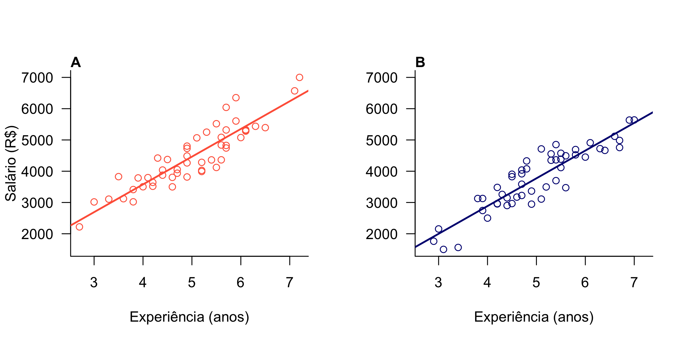

```{r setup, include=FALSE}
knitr::opts_chunk$set(echo = TRUE)
```


# Introdução

A análise exploratória de dados [_sensu_ @tukey_exploratory_1977; @zuur_protocol_2010] é um passo essencial. 

@tukey_exploratory_1977 dizia


## Incluindo a tabela

```{r}
sal <- read.csv("./Data/salarios.csv")

pander::pander(table(sal$sexo))
```


```{r, message=FALSE}
mh <- lm(salario ~ experiencia, data = sal[sal$sexo == "H", ])
pander::pander(mh)
```

## Incluindo uma imagem


``




```{r}

```

``


# References
